# 码神AI实战项目

> 在当下 AI 技术爆发、企业竞相数字化转型的浪潮中，拥有构建「智能体 + 工作流 + 知识库 + MCP + A2A」能力的人，将拥有极高的竞争力。
>

技术架构与详细设计：https://mp.weixin.qq.com/s/4aHqvOxiJou3R8P-yTqQxQ

想要购买此项目教程的，可以加我微信: mszlu521

* 提供前后端源码笔记视频
* 价格
  * 199 （不支持答疑）
  * 249 （支持答疑）

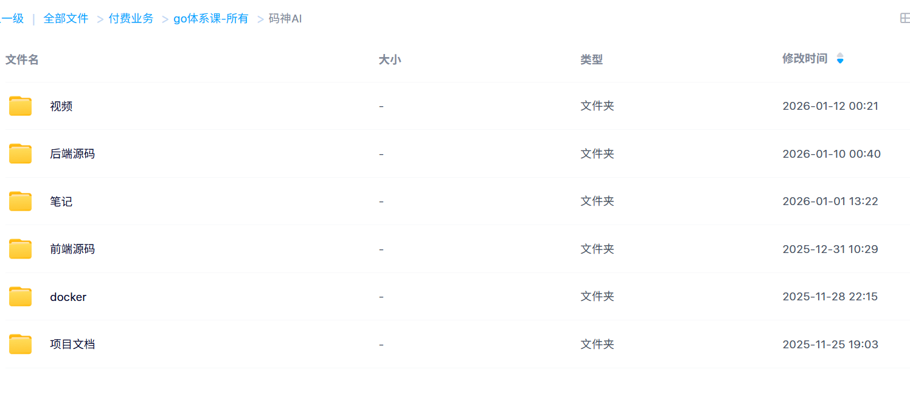

## 1. 项目展示

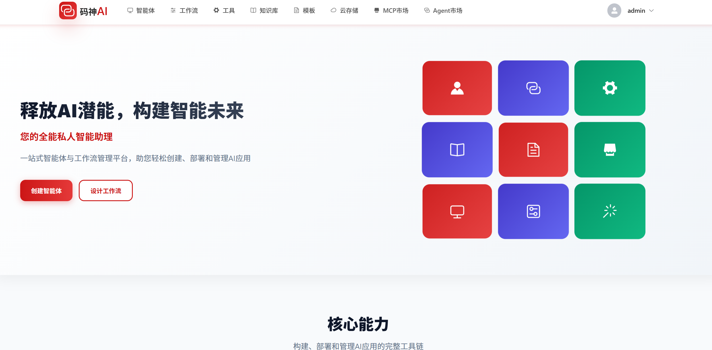

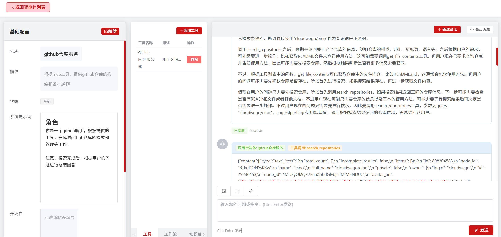

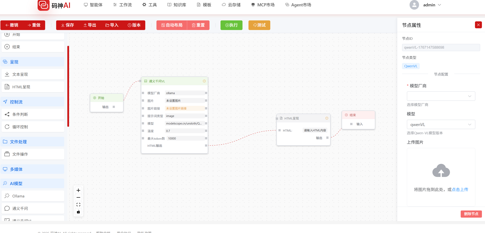

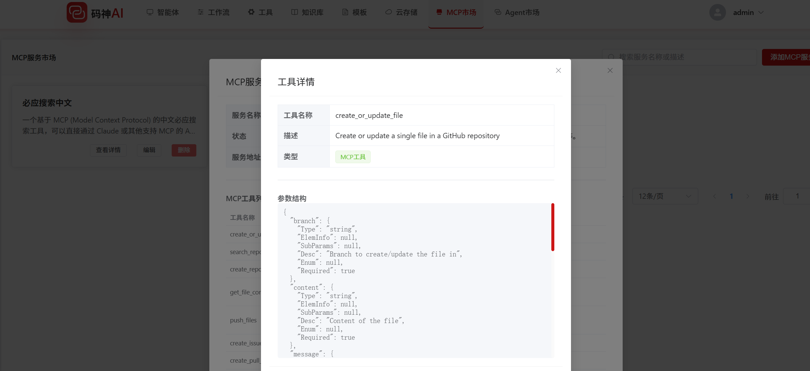

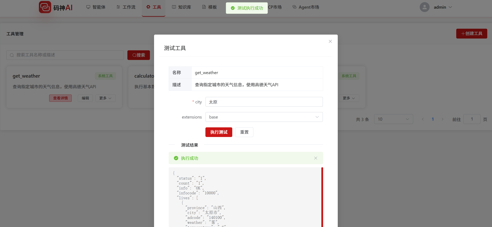

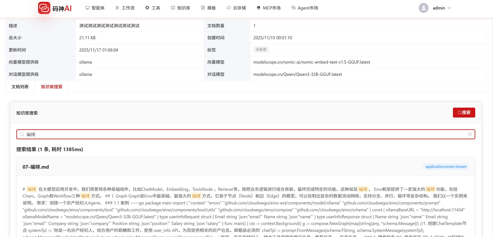

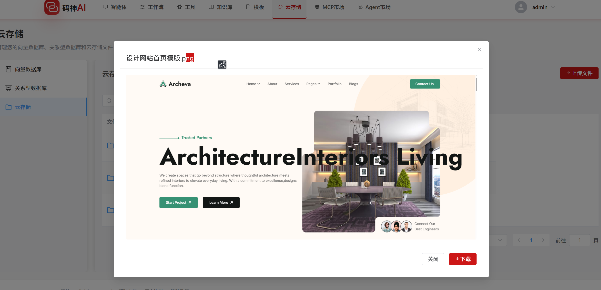

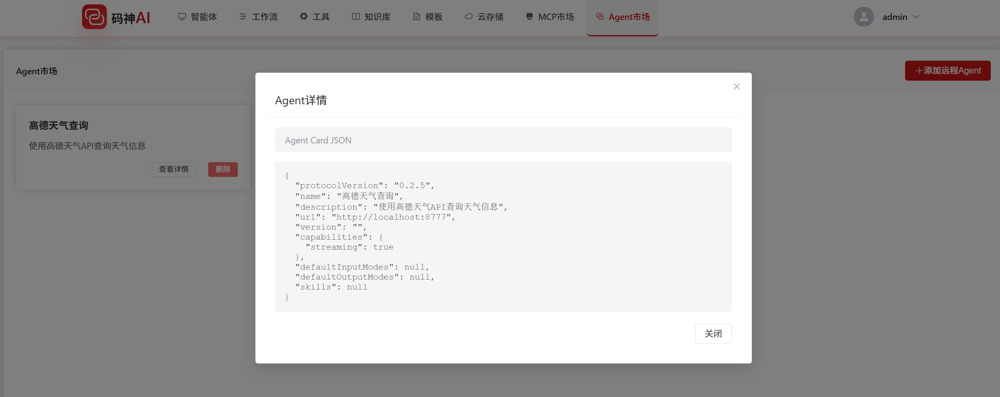

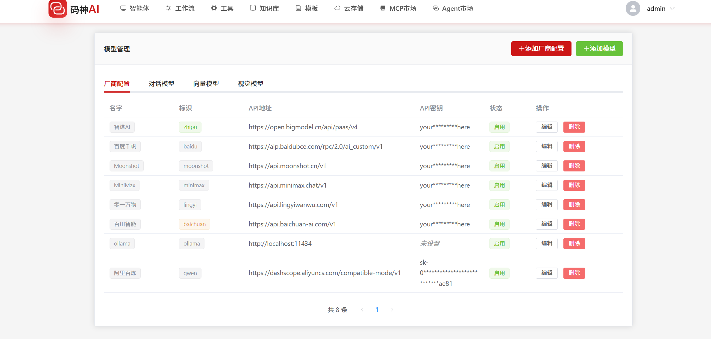

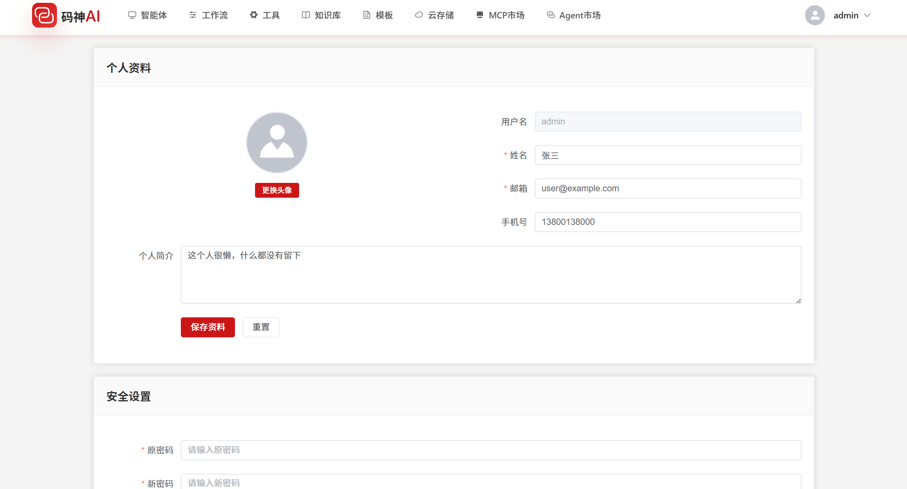

